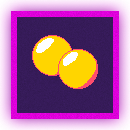
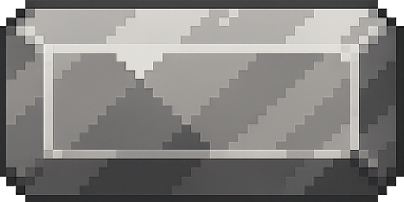
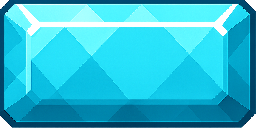
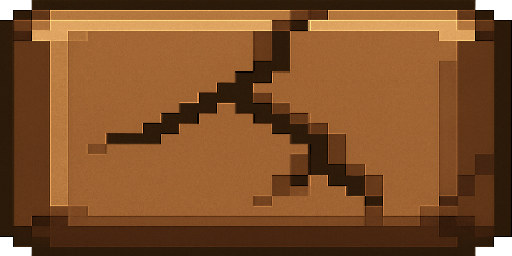
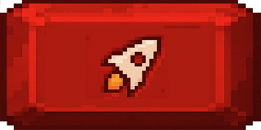
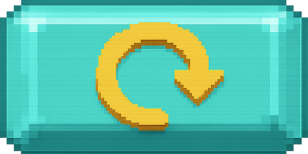
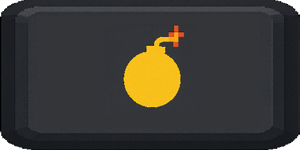
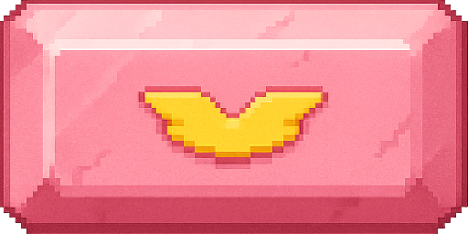

# Arkanoid Game - Object-Oriented Programming Project

## Author
Group 8 - Class 2526I-INT2204-11
1. Đinh Trung Kiên - 24021538
2. Nguyễn Thanh Duy - 24021449
3. Nguyễn Thành Dương - 24021441
4. Đào Văn Đức - 24021409

**Instructor**: Kiều Văn Tuyên / Trần Việt Cường

**Semester**: HK1/2025-2026

---

## Description
This is a classic Arkanoid game developed in Java as a final project for Object-Oriented Programming course. The project demonstrates the implementation of OOP principles and design patterns.

**Key features:**
1. The game is developed using Java 17+ with JavaFX/Swing for GUI.
2. Implements core OOP principles: Encapsulation, Inheritance, Polymorphism, and Abstraction.
3. Applies multiple design patterns: Singleton, Factory Method, Strategy, Observer, and State.
4. Features multithreading for smooth gameplay and responsive UI.
5. Includes sound effects, animations, and power-up systems.
6. Supports save/load game functionality and leaderboard system.

**Game mechanics:**
- Control a paddle to bounce a ball and destroy bricks
- Collect power-ups for special abilities
- Progress through multiple levels with increasing difficulty
- Score points and compete on the leaderboard

---

## UML Diagram

### Class Diagram

_Có thể sử dụng IntelliJ để generate ra Class Diagrams: https://www.youtube.com/watch?v=yCkTqNxZkbY_

*Complete UML diagrams are available in the `docs/uml/` folder*

---

## Design Patterns Implementation

_Có dùng hay không và dùng ở đâu_

### 1. Singleton Pattern
**Used in:** `GameManager`, `AudioManager`, `ResourceLoader`

**Purpose:** Ensure only one instance exists throughout the application.

### 2. Strategy Pattern
**Used in:** `BrickEvent`, `BrickGenMap`

**Purpose:** 
### 3. Factory Pattern
**Used in:**

**Purpose:**

### 4.Composite Pattern
**Used in:**

**Purpose:** 

### 5. Adapter
**Used in:**

**Purpose:**
### 6. Prototype
**Used in:**

**Purpose:**

### 7. Chain of Responsibility
**Used in:** `balanceRule`

**Purpose:**

---

## Multithreading Implementation
Không sử dụng hay cài đặt

---

## Installation

1. Clone the project from the repository.
2. Open the project in the IDE.
3. Run the project.

## Usage

### Controls
| Key | Action |
|-----|--------|
| `←` or `A` | Move paddle left |
| `→` or `D` | Move paddle right |
| `SPACE` | Launch ball / Shoot laser |
| `P` or `ESC` | Pause game |
| `R` | Restart game |
| `Q` | Quit to menu |

### How to Play
1. **Start the game**: Click "New Game" from the main menu.
2. **Control the paddle**: Use arrow keys or A/D to move left and right.
3. **Launch the ball**: Press SPACE to launch the ball from the paddle.
4. **Destroy bricks**: Bounce the ball to hit and destroy bricks.
5. **Collect power-ups**: Catch falling power-ups for special abilities.
6. **Avoid losing the ball**: Keep the ball from falling below the paddle.
7. **Complete the level**: Destroy all destructible bricks to advance.

### Power-ups
| Icon                                                                 | Name         | Effect |
|----------------------------------------------------------------------|--------------|---|
|  |      Blizzard Ball        |Attach frostbite effect to the ball|
|  | Duplicate Ball | Duplicate the number of existing ball |
|  | Fire Ball | Attach Burn effect to the ball |
|      | Recovery | Heal player by an amount of health |

### Bricks

| Icon | Name | Effect | Health |
|---|---|---|---|
|  | Normal | No Effect | 36 |
|  | Steel | No Effect | 90 |
|  | Diamond | No Effect | 999 |
|  | Rock | Destroy all brick in same column or same row | 90 |
|  | Rocket | Select amount of random brick then destroy them | 90 |
|  | Wheel | Destroy all brick in two random column | 90 |
|  | Gift | Increase amount of health for all brick that have same side with it | 90 |
|  | Bomb | Destroy all brick that have same side | 90 |
|  | Angel | Increase amount of health for some random brick | 90 |

### Scoring System
- Normal Brick: 100 points
- Strong Brick: 300 points
- Explosive Brick: 500 points + nearby bricks
- Power-up Collection: 50 points
- Combo Multiplier: x2, x3, x4... for consecutive hits

---

## Demo

### Screenshots

**Main Menu**  

**Gameplay**  

**Power-ups in Action**  

**Leaderboard**  

### Video Demo

*Full gameplay video is available in `docs/demo/gameplay.mp4`*

---

## Future Improvements

### Planned Features
1. **Additional game modes**
    - Time attack mode
    - Survival mode with endless levels
    - Co-op multiplayer mode

2. **Enhanced gameplay**
    - Boss battles at end of worlds
    - More power-up varieties (freeze time, shield wall, etc.)
    - Achievements system

3. **Technical improvements**
    - Migrate to LibGDX or JavaFX for better graphics
    - Add particle effects and advanced animations
    - Implement AI opponent mode
    - Add online leaderboard with database backend

---

## Technologies Used

| Technology | Version | Purpose |
|------------|---------|---------|
| Java | 17+ | Core language |
| JavaFX | 19.0.2 | GUI framework |
| Gradle | 3.9+ | Build tool |
| Jackson | 2.15.0 | JSON processing |

---

## License

This project is developed for educational purposes only.

**Academic Integrity:** This code is provided as a reference. Please follow your institution's academic integrity policies.

---

## Notes

- The game was developed as part of the Object-Oriented Programming with Java course curriculum.
- All code is written by group members with guidance from the instructor.
- Some assets (images, sounds) may be used for educational purposes under fair use.
- The project demonstrates practical application of OOP concepts and design patterns.

---

*Last updated: [Ngày/Tháng/Năm]*

