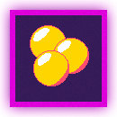
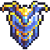
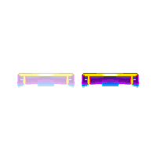
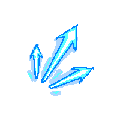
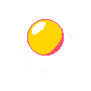
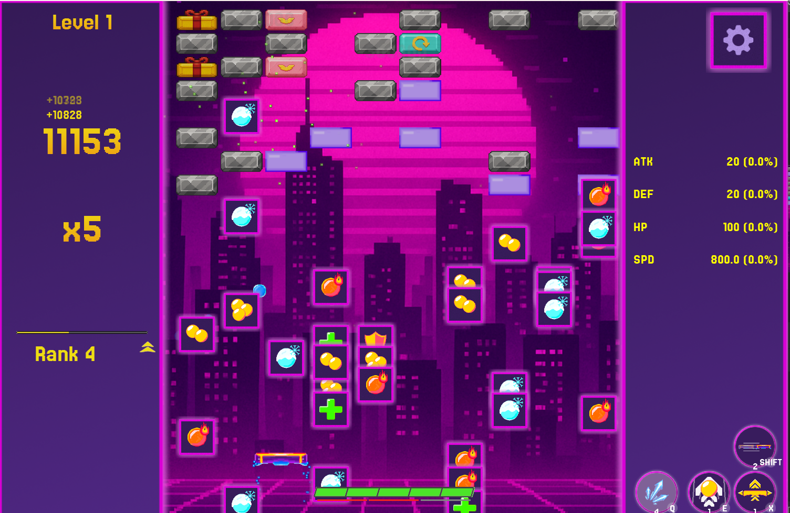

# Arkanoid Game - Object-Oriented Programming Project

## Author
Group 8 - Class 2526I-INT2204-11
1. Đinh Trung Kiên - 24021538
2. Nguyễn Thanh Duy - 24021449
3. Nguyễn Thành Dương - 24021441
4. Đào Văn Đức - 24021409

**Instructor**: Kiều Văn Tuyên / Trần Hoàng Việt
**Semester**: HK1/2025-2026

---

## Description
This is a classic Arkanoid game developed in Java as a final project for Object-Oriented Programming course. The project demonstrates the implementation of OOP principles and design patterns.

**Key features:**
1. The game is developed using Java 17+ with JavaFX for GUI.
2. Implements core OOP principles: Encapsulation, Inheritance, Polymorphism, and Abstraction.
3. Applies multiple design patterns: Singleton, Factory Method, Strategy, Observer, and State.
4. Includes sound effects, animations.
5. Supports save/load game functionality and leaderboard system.
6. Update gameplay by adding a boss, skill system and power-up system. 

**Game mechanics:**
- Control a paddle to bounce a ball and destroy bricks
- Collect power-ups for special abilities
- Progress through multiple levels with increasing difficulty
- Defeat boss
- Score points and compete on the leaderboard

---

## UML Diagram

### Class Diagram

---

## Design Patterns Implementation

### 1. Singleton Pattern
**Used in:** `GameManager`, `AudioManager`, `ResourceLoader`, etc.

**Purpose:** Ensure only one instance exists throughout the application.

### 2. Strategy Pattern
**Used in:** `BrickEvent`, `BrickGenMap`

**Purpose:** Allows defining a family of algorithms (e.g., different event logics or map generation styles), putting each into a separate class, and making their objects interchangeable.

### 3. Factory Pattern
**Used in:** `ObstaclePrefab`, `Particle`, `Prefab`

**Purpose:** Provides an interface for creating objects, but lets subclasses (or handler classes) decide which class to instantiate. It centralizes object creation logic.

### 4.Composite Pattern
**Used in:** `GameObject`, any class under `MonoBehaviour`

**Purpose:** Lets you compose objects into tree structures to represent part-whole hierarchies. It allows clients to treat individual objects and compositions of objects uniformly.

### 5. Adapter
**Used in:** `AnimationClipAdapter`

**Purpose:** Allows objects with incompatible interfaces to collaborate. It acts as a wrapper or translator between two different interfaces.

### 6. Prototype
**Used in:** `Brick.Init`

**Purpose:** Lets you copy existing objects (prototypes) without making your code dependent on their concrete classes. Ideal for creating new objects by cloning a pre-configured template.

### 7. Chain of Responsibility
**Used in:** `balanceRule`

**Purpose:** Lets you pass requests along a chain of handlers. Upon receiving a request, each handler decides either to process the request or to pass it to the next handler in the chain.

---

## Multithreading Implementation
Not implemented.

---

## Installation

1. Clone the project from the repository.
2. Open the project in the IDE.
3. Download VLC application.
4. Run the project.

## Usage

### Controls
| Key | Action |
|-----|--------|
| `←` or `A` | Move paddle left |
| `→` or `D` | Move paddle right |
| `Q` | Use Laser Beam skill |
| `E` | Use Updraft skill |
| `X`| Use Invincible skill|
| `SHIFT` | Use Dash Skill|

### How to Play
1. **Start the game**: Click "Start" from the main menu.
2. **Control the paddle**: Use arrow keys or A/D to move left and right.
3. **Launch the ball**: Hold the mouse and drag to any direction desired, then release to shoot the ball.
4. **Destroy bricks**: Bounce the ball to hit and destroy bricks.
5. **Collect power-ups**: Catch falling power-ups for special abilities.
6. **Avoid losing the ball**: Keep the ball from falling below the paddle.
7. **Complete the level**: Destroy all destructible bricks to advance.
8. **Earn perks**: Earn a perk for every rank advanced.
9. **Boss fight**: Defeat boss every 5 levels.

### Power-ups
| Icon                                                                 | Name         | Effect |
|----------------------------------------------------------------------|--------------|---|
|  |      Blizzard Ball        |Attach frostbite effect to the ball|
|  | Duplicate Ball | Duplicate the number of existing ball |
|  | Fire Ball | Attach Burn effect to the ball |
|      | Recovery | Heal player by an amount of health |
| | Triplicate Ball | Triplicate the number of existing ball |
|  | Shield | Create a shield in the bottom to prevent the ball from falling |

### Skills
| Icon                                                                 | Name         | Effect |
|----------------------------------------------------------------------|--------------|---|
|  |      Invincible        |Make the player invincible, increase speed, increase size and create a shield|
|  | Dash | Make the paddle dash to a specific direction |
|  | Laser Beam | Fire a laser beam which goes up and deals damage to the enemies |
|  | Updraft | Make all the go-down balls change direction and fly up |

### Bricks

| Icon | Name | Effect | Health | Score | EXP |
|---|---|---|--------|-------|
|  | Normal | No Effect | 36     | 100     | 2     |
|  | Steel | No Effect | 80     | 320     |  6     |
|  | Diamond | No Effect | 999    | 280     | 8     |
|  | Rock | Destroy all brick in same column or same row | 100    | 130     |  4     |
|  | Rocket | Select amount of random brick then destroy them | 100    | 110     |  7     |
|  | Wheel | Destroy all brick in two random column | 100    | 90     |   3     |
|  | Gift | Increase amount of health for all brick that have same side with it | 100    | 50     | 2     |
|  | Bomb | Destroy all brick that have same side | 100    | 210     | 4     |
|  | Angel | Increase amount of health for some random brick | 100    | 180     |  5     |

### Scoring System
- Combo Multiplier: x2, x3, x4... for consecutive hits without losing every balls
- Score increment is based on the brick's score specified above, with an additional amount of the current combo

---

## Demo

### Screenshots

**Main Menu**  

**Gameplay**  

**Power-ups in Action**  

**Leaderboard**  

### Video Demo

*Full gameplay video is available in `docs/demo/gameplay.mp4`*

---

## Future Improvements

### Planned Features
1. **Perks System**
    - Earn a perk for each rank increased.
    - Perk helps player to increase their stat. 

2. **Enhanced gameplay**
    - Boss battle every 5 levels.
    - More power-up varieties (Blizzard Ball, Shield, Fire Ball, etc.).
    - Add skills for more strategic gameplay (Laser Beam, Dash,...).

3. **Technical improvements**
    - Use VLCJ for better videos experience.
    - Add particle effects and advanced animations.
    - Add records for ranking.
    - Clean UI.
    - Unity-based System.

---

## Technologies Used

| Technology | Version | Purpose |
|------------|---------|---------|
| Java | 17+ | Core language |
| JavaFX | 19.0.2 | GUI framework |
| Gradle | 2.0+ | Build tool |
| GSON | 2.11.0 | JSON processing |

---

## License

This project is developed for educational purposes only.

**Academic Integrity:** This code is provided as a reference. Please follow your institution's academic integrity policies.

---

## Notes

- The game was developed as part of the Object-Oriented Programming with Java course curriculum.
- All code is written by group members with guidance from the instructor.
- Some assets (images, sounds) may be used for educational purposes under fair use.
- The project demonstrates practical application of OOP concepts and design patterns.

---

*Last updated: [12/11/2025]*

